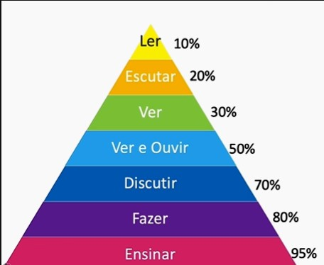
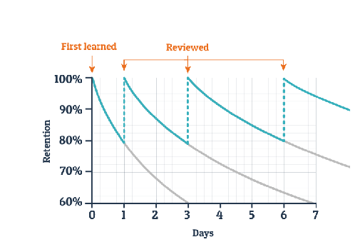

# 1. Aprendizagem como Estilo de Vida

Modelo de educação não nos ensinou a aprender


E se aprender fosse uma tecnica 

Criar experiências poderosas
Autoconhecimento e propósito
Estilos e tempos diferentes de aprender
Disciplina e planejamento
Neurociência
Hábitos bons e recorrentes
Técnicas efetivas de aprendizagem
Ferramentas que facilitam a vida

## Lifelong Learging

> O Analfabeto do séulo 21 não é aquele que não sabe ler e escrever, mas aquele que não sabe aprender, desaprender e reaprender

*Alvin Toffler*

Carreiras não são mais sequências de posições, são sequências de experiências

Agora, faça uma reflexão sobre seu papel como profissional:

- Qual habilidade sua que era fundamental 5 anos atrás e hoje já não é mais?
  - Entender circuitos eletrônicos, pois minha profissão era testar equipamentos eletrônicos. 
- No seu Mercado, o que está mudando? O que deveria ser um ponto de estudos seu agora?
  - Está sedo discutido a utilização de Inteligência Artificial para a programação e deveria começar a estudar esses utilizações.


## Razões para Aprender

Como focar?
Nunca foi conseguir me atualizar no tempo que o mercado precisa?

A saída é o **AUTOCONHECIMENTO**, preciso entender melhor o que me move, saber o que eu não sei.

IKIGAI
4 pilares
1. Aquilo que você ama
2. Aquilo que você é bom em fazer
3. Aquilo que você pode ser pago para fazer
4. Aquilo que o mundo precisa


### Reflexão

PEnsando em um intervalo de 1 ano
- Qual seu Ikigai?
  - Aquilo que você ama
    - Ensinar pessoas a mexer em eletrônicos
    - Estar atento a novidades
  - Aquilo que você é bom em fazer
    - Pensar em como solucionar problemas
    - 
  - Aquilo que você pode ser pago para fazer
    - Construir sistemas com foco no cliente
    - Discutir inovações no sistema do cliente
  - Aquilo que o mundo precisa
- Quais são suas razões para Aprender algo?
- Onde você quer se aprofundar?

## Estilos de Aprendizagem

Pessoas diferentes aprendem de **formas** diferentes em **tempos** diferentes

Percepção x Processamento


[Inventário de Estilo de Aprendizagem de Kolb disponibilizado pela Universidade de Pernambuco](https://estiloaprendizagemkolb.github.io/)

David Allen Kolb

### O que aprendemos nessa aula:

- Transformação digital gerando mais informações
- Nova trilha de carreira
- Lifelong Learning
- O que me move a aprender
- Múltiplas carreiras e linhas de aprendizado
- Ikigai
- Pessoas diferentes aprendem em tempos e formatos diferentes
- Teoria do Kolb
- Estilos de Aprendizagem

# 2. Talento ou Disciplina?

## Zona de aprendizagem

Zona de conforto -> zona de entusiasmo -> zona de estresse -> zona de aprendizagem
Não é possível pular as zonas, mas posso diminuir o tempo durante elas

[Como motivar na crise](https://pensadorh.wordpress.com/2016/04/18/como-motivar-na-crise/)

Lembretes
- Aprendizagem não ocorre na zona de conforto
- Fique perto de gente melhor que você! Se desafie a ser mais, a ir além
- Encontro seu ponto de equilíbrio do Flow

Pense em uma situação de aprendizagem que você já viveu e que teve dificuldades em sair da zona de estresse. Como foi essa situação? O que o deixou preso na zona de estresse?
R:

Agora liste 3 atitudes diferentes que você pode ter na próxima vez para não cometer os mesmos erros e passar rapidamente para a zona de Aprendizagem.
R: 

## Disciplina

**DIREÇÃO** é mais importante que **VELOCIDADE**

Disciplina é questão de hábito

[link para curso de hábitos da Aluna no meu github](https://)

Maxwell Maltz, 1960, 21 days a Habit

Phillippa Lally, 2009, 66 days 

### Hábitos
1. Disposição: Momento que desencadeia a ação, gatilho 
2. Rotina: A ação sendo repetida
3. Recompensa: Resultado positivo no fum que motiva a continuar

No processo de aprendizagem é interessante que tenhamos algo prático e tangível como recompensa, e que possamos aplicar o que aprendemos.

Aprendemos até agora:
- Lifelonf Learning
- Autoconhecimento e propósito
- Estilo individual de aprendizagem
- Zona de aprendizagem e Disciplina

## Elimine Barreiras

Ralos de atenção -> Aquilo que captura nossa atenção e leva embora, afasta daquilo em que realmente deveria estar repousada.

Remover as barreiras
- Falta de Tempo: ou será que não priorizo as atividades importantes, gerenciar meu tempo
- Distrações na internet: Criar espaços na minha agenda, o cérebro demora para voltar depois de uma distração
- Pensar em outras tarefas a serem feitas: Isso vai acontecer sempre, mas quando uma ideia passar é possível anotar ela, mas a um custo de atenção
- Não organizar antes de iniciar: é necessário organizar antes para que não pense em outras tarefas.
- Pessoas que te ligam ou vão até você: Isso vai acontecer, mas pode ser combinado que elas não interrompam você
- Achar que não posso crescer, medo de mudança: questão de disciplina e vou ser bom no que estiver estudando. Aprendizagem não é questão de talento
- Ansiedade: Fazer um momento de relaxamento antes de começar a estudar, uma tecnica é tapar uma narina e inspirar, depois tapar a outra narina e expirar. Umas 5 vezes. Expirar de maneira mais devagar do que inspirar
- Falta de celebração: Precisamos celebrar a recompensa dos nossos ganhos nos estudos:
  - Tomar um sorvete
  - Comer algo diferente
  - Comprar um presente
  - Ver algo na internet
  - Passar um tempo com alguém

```
A prática do feedback

Saber o que aprender é o primeiro passo para ser um bom “aprendedor” e se tornar um especialista na sua área de atuação. Além do autoconhecimento, o feedback é uma excelente prática para se desenvolver.

Convido você a levantar pelo menos 3 feedbacks com colegas de trabalho, gestor, ex-gestor ou até amigos mais próximos, com foco em atitudes que você poderia:

Continuar fazendo
Parar de fazer
Começar a fazer
Priorize dentre as sugestões duas coisas que você poderia focar agora no seu plano de desenvolvimento.

```

```
Outros bons hábitos

Além do feedback, aprendemos alguns outros bons hábitos para nos tornarmos um ótimo Lifelong Learner.

Pense sobre os hábitos que vimos no curso. Quais poderiam ser adotados por você na sua rotina de aprendizado? Como você vai colocar em prática?
```

## Hábitos para serem criados

1. Várias (e boas) fontes, formatos, autores, professores para eu buscar conhecimento
2. Curiosidade, fazer perguntas, diversão
3. Networking, poder da minha rede de contatos, troca de informações
4. Feedback
5. Encontre um mentor
6. Combine teoria e prática (tipos de aprendizados)

```
Das barreiras físicas e emocionais abaixo, qual a que mais lhe tira o foco? Alguma que você queira incluir na lista?

Distrações na internet como redes sociais, sites e e-mail
Pop-ups e atualizações no celular de aplicativos como Whatsapp e serviços de compras
Pessoas que te ligam ou vão até você no momento em que está estudando ou planejando sua atuação
Mindset fixo, achar que não tem as habilidades para crescer
Medo de mudança
Espaço físico inadequado para estudos e planejamento
Situações ou problemas ainda não resolvidos no trabalho, ou até mesmo da vida pessoal.
```

```
Cada um tem suas barreiras mais e menos críticas. Quais são suas duas barreiras que mais atrapalham? Como e quando elas acontecem?

Agora, para cada uma delas, defina um plano de ação para colocar em prática e evitar que elas atrapalhem sua rotina.
```

### O que aprendemos nesta aula:

- Zona de conforto e Zona de Aprendizagem;
- Importância de sair da zona de estresse;
- Estado de flow, felicidade, empolgação;
- Direção é mais importante que velocidade;
- Um pouquinho todo dia gera muitas horas de aprendizado;
- Um hábito demora tempo para ser criado, não desista no meio;
- Crie bons hábitos;
- Dicas de hábitos de um bom aprendiz;
- Ralos de Atenção;
- Barreiras físicas e emocionais;
- Distrações;
- Ansiedade;
- Celebração.

# 3. Desvendando o Cérebro

## Mindset fixo e de crescimento

Livro: Mindset -> Carol S. Djweck

Dois tipos de Mindset:
- Fixo: De acordo com o livro, que nos dificulta a aprender novas habilidades
- Crescimento: De cordo com o livro, impulsiona e facilita nosso processo de aprendizagem

| Mindset Fixo                               | Mindset Crescimento                          |
| ------------------------------------------ | -------------------------------------------- |
| Quantidade de inteligência é algo limitado | A quantidade de inteligência é ilimitada     |
| Sou bom apenas em certas coisas            | Posso ser bom em qualquer coisa              |
| Desisto quando fica muito difícil          | Vamos fazer dar certo!                       |
| Não me sinto bem com grandes desafios      | Adoro grandes desafios                       |
| Feedback é uma crítica                     | Feedback é uma ajuda para crescer            |
| Prefiro fazer coisas que já sei            | Gosto de aprender a fazer coisas que não sei |


[Carol Dweck Revisits the 'Growth Mindset'](https://caelum-online-public.s3.amazonaws.com/1504-aprenda-a-aprender/03/carol+dweck+growth+mindsets.pdf)

Será que o Mindset pode mudar ao longo da vida?
- Busca inspiração em Mentores
- Autoconfiança
- Aproveite as oportunidades
- Motivação e foco
- Dedicação

```
Como Podemos moldar nosso mindset e reforçar o modelo mental de crescimento?

Lembre de duas possibilidades que ensinamos no curso e pense como você pode colocar em prática no seu dia a dia.
```

## Modos Focado e Difuso

Modelo focado: Nosso cérebro está focado na soução de problemas pontuais, usando caminhos recorrentes, utilizando metologias familiares
Modelo difuso: Nosso cérebro está distraído, sem metodologia conhecida, acaba achando novos caminhos

| Focado               | Difuso                 |
| -------------------- | ---------------------- |
| Concentração         | Visão Ampliada         |
| Repetir padrões      | Conexões inconscientes |
| Planejado            | Aleatório              |
| Problemas conhecidos | Novas soluções         |

Como colocar o modo difuso para trabalhar?
- Estudar mais de um tema por vez
- Ler dois livros ao mesmo tempo
- Ter um emprego e um projeto voluntário
- Não abrir mão dos momentos de ócio

```
Por que é tão importante despertar o modo difuso de funcionamento do cérebro? O que ele faz? E como podemos ativar o funcionamento desse modo?
```

### Formatos de aprendizagem

Aprendendo as melhores maneiras de aprender de forma eficiente, mas algo é fato: existe vários caminhos possíveis e algum vai servir para mim

| Caminho auditivo         | Caminho visual | Caminho leitura/escrita | Caminhos cinestésico |
| ------------------------ | -------------- | ----------------------- | -------------------- |
| podcast                  | infográficos   | livros                  | eventos              |
| audio books              | power points   | sites                   | on the job/carona    |
| ouvir gravações de aulas | TEDs           | blogs                   | projetos             |
|                          | video aulas    | artigos                 |                      |
|                          | mapa mental    | resumos                 |                      |

Utilizando somente um desses caminhos, estou utilizando meu cérebro pelo modo focado, sem utilizar ele de modo difuso. A melhor maneira é utilizar todos os caminhos, misturando eles.

#### Como Aprendemos por *Willian Glasser*


```
Agora que você já conhece os formatos de aprendizagem e a maneira de aproveitar melhor cada um deles, chegou a hora de saber qual é o seu formato preferido, e assim poder aproveitar seu potencial máximo de autodesenvolvimento.

Mas lembre-se, é importante aproveitar todos os estilos e misturá-los, assim você ganha mais fontes e ferramentas para se tornar um super Lifelong Learner.
```
[https://vark-learn.com/the-vark-questionnaire/](https://vark-learn.com/the-vark-questionnaire/)

### Prática distribuída x Cramming

> Eu estudo, mas escueço tudo logo depois e não sei o que fazer!
#### Fala recorrente

Curva de Ebbinghaus


Em 1885, Ebbinghaus estudou a capacidade da memória de reconhecimento ao longo do tempo. Em média, as pessoas quando estudam algo, depois de 10 minutos ainda retêm esse conhecimento 100%. Depois de 24h, essa porcentagem cai para 40%. Passada uma semana, o valor cai novamente e chega a 20% e depois de um mês 10%.

Ebbinghaus descobriu o **poder das revisões**.

Depois de uma hora fazemos a revisão do que aprendemos, então depois de 24h fazemos novamente uma revisão, e assim sucessivamente, até que nosso cérebro de fato solidifique esse saber. As revisões são muito poderosas em construir memórias fixas.

#### cramming
Aprender basicamente altos volumes de conteúdo em curto prazo, para decorar. É útil para informações utilizadas em menos de 24hs.

A melhor forma de fixar conhecimento é realizar a **prática distribuída**, que consiste em uma linha do tempo distribuímos os estudos para que parte desses momentos façam parte das revisões, utilizando a piramide e vários formatos diferentes de aprendizagem. 


```
Prática distribuída ou Cramming? Qual dos dois funciona melhor para um processo de aprendizagem mais eficaz? Por quê?
R:
```

### Memória de longo prazo

Aprendizagem é o processo de **adquirir informação** para **memória de longo prazo**, juntar diferentes **blocos de conhecimento** e **saber aplicar**

- Conhecimento precisa de **tempo** para se tornar aprendizado
- Precisa integrar diferentes conhecimentos
- Necessário de ideias e impactos
- Descontruir uma habilidade em sub-habilidades, pequenas partes a serem aprendidas (modo difuso)
- Blocos (Chunks)
  - Pequenos grupos de informação
  - Informação com mesmo significado
  - Uma macroideia
  - Fácil de lembrar
  - Mais facilmentes absorvidos
- Como formar blocos?
  - Palavras
    - Substantivos
    - Verbos
    - Preposições e conjunções
  - Frases
    - Afirmações
    - Perguntas
    - Comentários
  - Parágrafos
    - Histórias
    - Reflexões
    - Explicações
- Como Gravar um Bloco?
  - Decorar x entender
  - Foco na hora de estudar
  - Conhecer o contexto de utilização
  - Assimilar a outros blocos de conhecimento
  - Saber aplicar sozinho

> Aplicar em diferentes situações e revisar por diferentes métodos faz seu cérebro saber acessar por diferentes caminhos

> **DISCIPLINA**

```
O que a construção de um muro tem em comum com a construção de memórias de longo prazo?
R:
```

```
Pense no próximo desafio de aprendizado que você tem. Como você pode, com base nos exemplos do curso, quebrá-lo em pequenos blocos e organizar seu processo de aprendizagem?
R:
```

### O que aprendemos nesta aula:

- Como o cérebro funciona no processo de aprendizagem
- Mindset fixo x mindset de crescimento
- Que crenças podem fortalecer meu mindset de crescimento
- O papel do Professor no fortalecimento do Mindset de Crescimento
- Modelo focado e difuso
- Como cérebro faz novas conexões
- Importância dos momentos de ócio para criatividade e aprendizado
- Formatos de aprendizagem diferentes para estilos e momentos diferentes
- Importância de misturar os formatos para potencializar o poder do cérebro
- Pirâmide de Willian Glasser
- Curva do esquecimento de Ebbinghaus
- O poder das revisões ao longo do tempo
- Cramming: decorar altos volumes de informação funciona?
- Prática distribuída ao longo do tempo