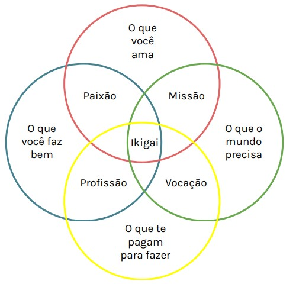
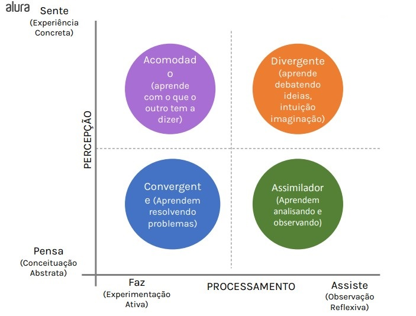

# 1. Aprendizagem como Estilo de Vida

Modelo de educação não nos ensinou a aprender

E se aprender fosse uma tecnica 

Criar experiências poderosas
Autoconhecimento e propósito
Estilos e tempos diferentes de aprender
Disciplina e planejamento
Neurociência
Hábitos bons e recorrentes
Técnicas efetivas de aprendizagem
Ferramentas que facilitam a vida

## Lifelong Learging

> O Analfabeto do séulo 21 não é aquele que não sabe ler e escrever, mas aquele que não sabe aprender, desaprender e reaprender

*Alvin Toffler*

Carreiras não são mais sequências de posições, são sequências de experiências

Agora, faça uma reflexão sobre seu papel como profissional:

- Qual habilidade sua que era fundamental 5 anos atrás e hoje já não é mais?
  - Entender circuitos eletrônicos, pois minha profissão era testar equipamentos eletrônicos. 
- No seu Mercado, o que está mudando? O que deveria ser um ponto de estudos seu agora?
  - Está sedo discutido a utilização de Inteligência Artificial para a programação e deveria começar a estudar esses utilizações.

## Razões para Aprender

Como focar?
Nunca foi conseguir me atualizar no tempo que o mercado precisa?

A saída é o **AUTOCONHECIMENTO**, preciso entender melhor o que me move, saber o que eu não sei.

IKIGAI
4 pilares
1. Aquilo que você ama
2. Aquilo que você é bom em fazer
3. Aquilo que você pode ser pago para fazer
4. Aquilo que o mundo precisa

### Reflexão

PEnsando em um intervalo de 1 ano
- Qual seu Ikigai?
  - Aquilo que você ama
    - Ensinar pessoas a mexer em eletrônicos
    - Estar atento a novidades
  - Aquilo que você é bom em fazer
    - Pensar em como solucionar problemas
    - 
  - Aquilo que você pode ser pago para fazer
    - Construir sistemas com foco no cliente
    - Discutir inovações no sistema do cliente
  - Aquilo que o mundo precisa
- Quais são suas razões para Aprender algo?
- Onde você quer se aprofundar?

## Estilos de Aprendizagem

Pessoas diferentes aprendem de **formas** diferentes em **tempos** diferentes

Percepção x Processamento

[Inventário de Estilo de Aprendizagem de Kolb disponibilizado pela Universidade de Pernambuco](https://estiloaprendizagemkolb.github.io/)

David Allen Kolb

### O que aprendemos nessa aula:

- Transformação digital gerando mais informações
- Nova trilha de carreira
- Lifelong Learning
- O que me move a aprender
- Múltiplas carreiras e linhas de aprendizado
- Ikigai
- Pessoas diferentes aprendem em tempos e formatos diferentes
- Teoria do Kolb
- Estilos de Aprendizagem